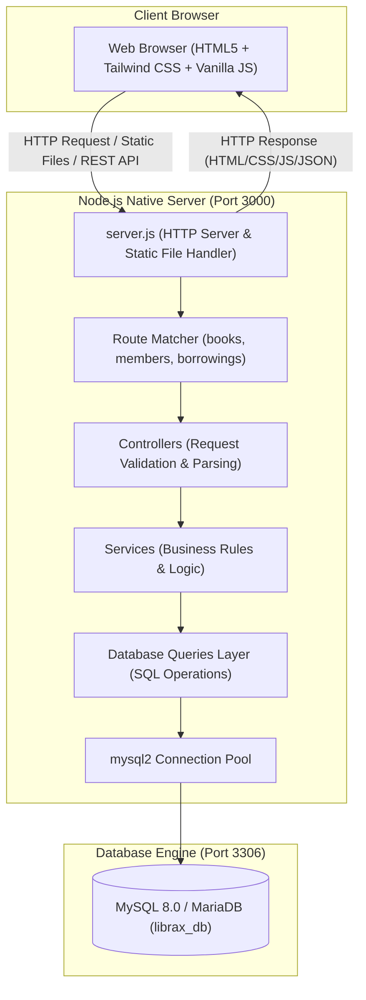
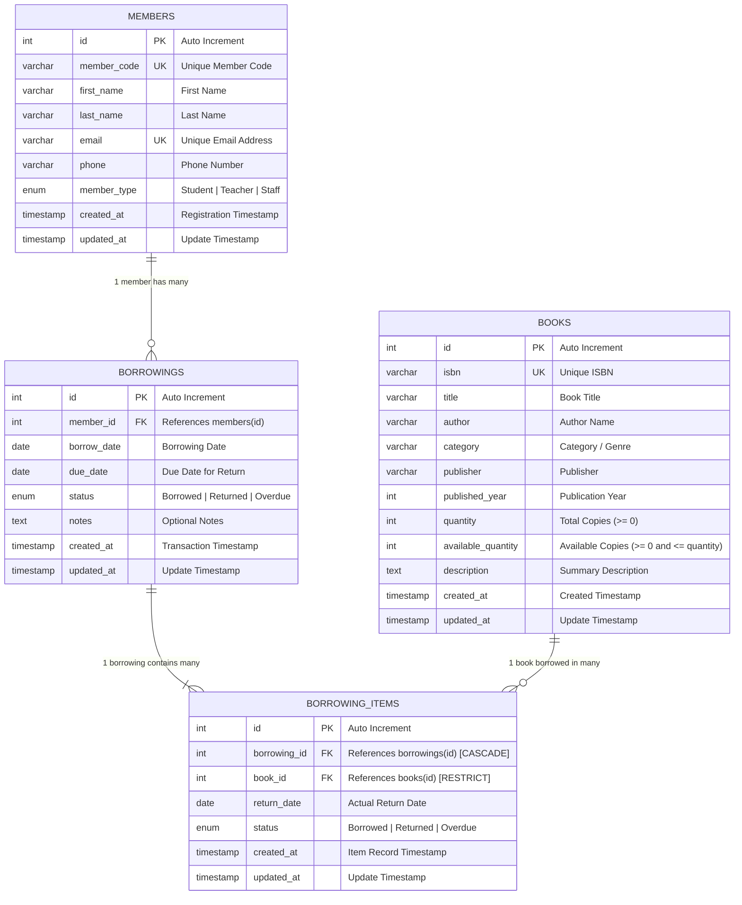
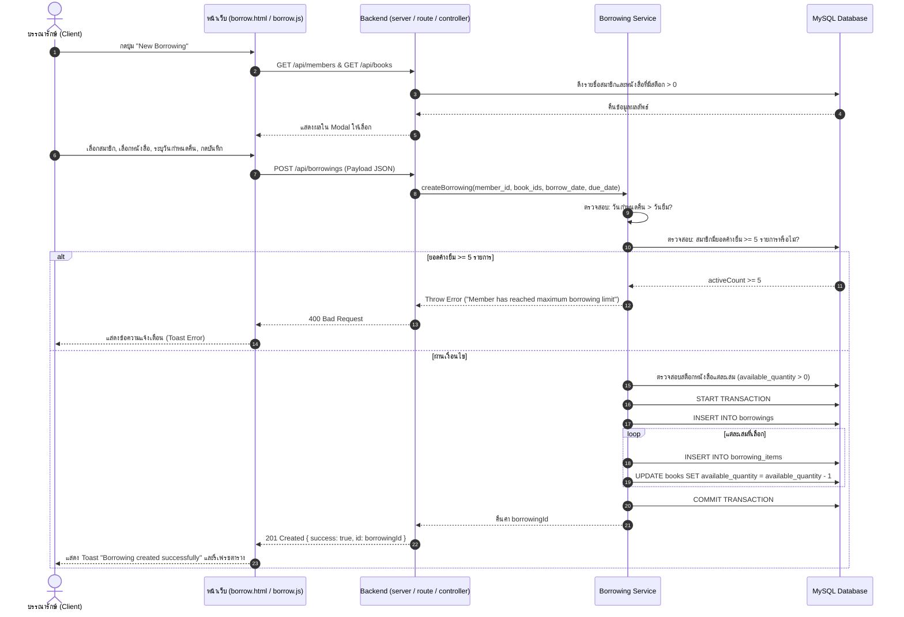
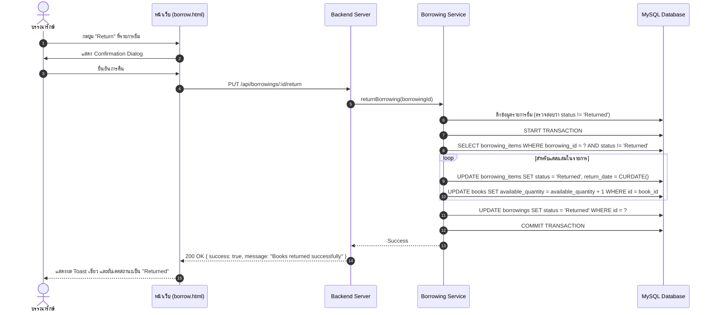

# เอกสารรายงานการพัฒนาระบบ (System Development Report)
## โครงการ: LibraX Digital Library Management System (ระบบจัดการห้องสมุดดิจิทัล)

---

### ข้อมูลเบื้องต้นของโครงการ (Document Control)
- **ชื่อโครงการ:** LibraX Digital Library Management System
- **ประเภทของระบบ:** เว็บแอปพลิเคชันจัดการระบบงานห้องสมุดดิจิทัล (Web-based Digital Library Management)
- **เวอร์ชันระบบ:** 1.0.0
- **สถานะระบบ:** พร้อมใช้งาน (Production-Ready)
- **วันที่จัดทำเอกสาร:** 15 กันยายน 2026

---

## สารบัญ (Table of Contents)
1. [บทนำและภาพรวมโครงการ (Introduction & Project Overview)](#1-บทนำและภาพรวมโครงการ-introduction--project-overview)
2. [การวิเคราะห์ความต้องการของระบบ (System Requirements)](#2-การวิเคราะห์ความต้องการของระบบ-system-requirements)
3. [สถาปัตยกรรมระบบและการเลือกใช้เทคโนโลยี (System Architecture & Tech Stack)](#3-สถาปัตยกรรมระบบและการเลือกใช้เทคโนโลยี-system-architecture--tech-stack)
4. [การออกแบบฐานข้อมูล (Database Design & Data Dictionary)](#4-การออกแบบฐานข้อมูล-database-design--data-dictionary)
5. [การออกแบบกระบวนการทำงานและผังการไหลของข้อมูล (System Workflows & Data Flows)](#5-การออกแบบกระบวนการทำงานและผังการไหลของข้อมูล-system-workflows--data-flows)
6. [ข้อกำหนดและการออกแบบส่วนต่อประสานโปรแกรมประยุกต์ (API Specification)](#6-ข้อกำหนดและการออกแบบส่วนต่อประสานโปรแกรมประยุกต์-api-specification)
7. [การออกแบบส่วนติดต่อผู้ใช้งาน (UI/UX & Frontend Design)](#7-การออกแบบส่วนติดต่อผู้ใช้งาน-uiux--frontend-design)
8. [ความมั่นคงปลอดภัยและการจัดการข้อผิดพลาด (Security & Error Handling)](#8-ความมั่นคงปลอดภัยและการจัดการข้อผิดพลาด-security--error-handling)
9. [คู่มือการติดตั้งและการนำระบบขึ้นใช้งาน (Installation & Deployment Guide)](#9-คู่มือการติดตั้งและการนำระบบขึ้นใช้งาน-installation--deployment-guide)
10. [การทดสอบระบบและการประเมินผล (Testing & Evaluation)](#10-การทดสอบระบบและการประเมินผล-testing--evaluation)
11. [บทสรุปและแผนการพัฒนาต่อยอด (Conclusion & Future Roadmap)](#11-บทสรุปและแผนการพัฒนาต่อยอด-conclusion--future-roadmap)

---

## 1. บทนำและภาพรวมโครงการ (Introduction & Project Overview)

### 1.1 ที่มาและความสำคัญ
ในยุคดิจิทัล การบริหารจัดการทรัพยากรสารสนเทศในสถาบันการศึกษาและห้องสมุดจำเป็นต้องมีความคล่องตัว รวดเร็ว และตรวจสอบได้อย่างแม่นยำ ระบบห้องสมุดแบบเดิมมักประสบปัญหาการบันทึกข้อมูลซ้ำซ้อน การตรวจสอบสถานะหนังสือคงคลังที่ล่าช้า และความยุ่งยากในการติดตามการยืม-คืน 

โครงการ **LibraX Digital Library Management System** ได้รับการพัฒนาขึ้นเพื่อเป็นโซลูชันการบริหารจัดการห้องสมุดยุคใหม่ที่เน้นความเร็ว ความเรียบง่ายในการติดตั้ง (Lightweight & Low Dependency) และความเสถียร โดยออกแบบให้รองรับการทำงานของบุคลากรห้องสมุด อาจารย์ บุคลากร และนักศึกษาได้อย่างครบวงจร

### 1.2 วัตถุประสงค์ของโครงการ
1. เพื่อพัฒนาระบบบริหารจัดการทรัพยากรหนังสือและสื่อดิจิทัลให้สามารถจัดเก็บ ค้นหา กรอง และติดตามสถานะได้อย่างมีประสิทธิภาพ
2. เพื่อพัฒนาระบบฐานข้อมูลสมาชิกห้องสมุดที่รองรับการจำแนกประเภทสมาชิก (Student, Teacher, Staff)
3. เพื่อพัฒนาระบบการยืม-คืนหนังสือที่มีการควบคุมความถูกต้องทางธุรกรรม (ACID Transactions) และจำกัดสิทธิ์การยืมตามเงื่อนไขที่กำหนด
4. เพื่อสร้างแดชบอร์ดสรุปผลเชิงสถิติ (Overview Statistics) ช่วยให้ผู้ดูแลระบบมองเห็นภาพรวมการใช้งานห้องสมุดได้ทันทีแบบเรียลไทม์

### 1.3 ขอบเขตของระบบ (Scope of Work)
ระบบครอบคลุมขอบเขตการทำงาน 5 โมดูลหลัก ได้แก่:
- **โมดูลแดชบอร์ด (Dashboard Module):** สรุปยอดหนังสือทั้งหมด, จำนวนสมาชิก, การยืมที่กำลังดำเนินการ, รายการเกินกำหนด (Overdue) และประวัติกิจกรรมล่าสุด
- **โมดูลจัดการข้อมูลหนังสือ (Book Catalog Management):** เพิ่ม, ลบ, แก้ไข, ค้นหา (Search by Title/Author/ISBN), กรองตามหมวดหมู่ (Category Filter) พร้อมตรวจนับจำนวนคงเหลือ (Available Quantity)
- **โมดูลจัดการสมาชิก (Member Management):** บันทึกรหัสสมาชิก, ข้อมูลติดต่อ, ประเภทสมาชิก และประวัติการยืมของสมาชิกแต่ละราย
- **โมดูลบริการยืม-คืนหนังสือ (Circulation Management):** การสร้างใบยืมหนังสือพร้อมกันได้หลายเล่ม, การคืนหนังสือทั้งชุด, การตรวจสอบสต็อกหนังสือแบบอัตโนมัติ
- **โมดูลประวัติและการติดตามสถานะ (Borrowing History & Tracking):** รายการประวัติยืม-คืนย้อนหลังทั้งหมด พร้อมระบบค้นหาและกรองสถานะ (Borrowed, Returned, Overdue)

### 1.4 กลุ่มผู้ใช้งานเป้าหมาย (Target Users)
| กลุ่มผู้ใช้งาน | คำอธิบายและสิทธิ์การใช้งาน |
| :--- | :--- |
| **บรรณารักษ์ / ผู้ดูแลระบบ (Librarian / Admin)** | ผู้ใช้งานหลักที่เข้าถึงระบบเพื่อบันทึกหนังสือ, จัดการสมาชิก, บันทึกการยืม-คืน และดูรายงานสถิติ |
| **สมาชิกห้องสมุด (Members)** | นักศึกษา (Student), อาจารย์ (Teacher), เจ้าหน้าที่ (Staff) ที่มีประวัติการยืมในระบบ |

---

## 2. การวิเคราะห์ความต้องการของระบบ (System Requirements)

### 2.1 ความต้องการเชิงหน้าที่ (Functional Requirements: FR)
- **FR-01: ระบบแดชบอร์ดและสถิติ (Dashboard & Analytics)**
  - FR-01.1 ระบบต้องคำนวณและแสดงจำนวนหนังสือทั้งหมดในคลัง (Total Books)
  - FR-01.2 ระบบต้องแสดงจำนวนสมาชิกที่ลงทะเบียนทั้งหมด (Total Members)
  - FR-01.3 ระบบต้องแสดงจำนวนรายการยืมที่ยังไม่ได้คืน (Active Borrowings)
  - FR-01.4 ระบบต้องแสดงจำนวนรายการที่เกินกำหนดส่ง (Overdue Borrowings)
  - FR-01.5 ระบบต้องแสดงรายการยืม-คืนล่าสุด (Recent Activities) แบบเรียลไทม์
- **FR-02: ระบบจัดการหนังสือ (Book Catalog Management)**
  - FR-02.1 ผู้ใช้สามารถเพิ่มข้อมูลหนังสือใหม่ พร้อมตรวจสอบ ISBN ไม่ให้ซ้ำกัน
  - FR-02.2 ผู้ใช้สามารถแก้ไขข้อมูลหนังสือ และปรับปรุงจำนวนเล่มทั้งหมด (Quantity)
  - FR-02.3 ผู้ใช้สามารถลบหนังสือออกจากระบบได้ (ยกเว้นหนังสือที่อยู่ระหว่างการยืม)
  - FR-02.4 ระบบต้องสามารถค้นหาหนังสือแบบ Real-time ตามชื่อเรื่อง, ผู้แต่ง, หรือ ISBN
  - FR-02.5 ระบบต้องสามารถกรองหนังสือตามหมวดหมู่ได้
  - FR-02.6 ระบบต้องคำนวณสถานะสต็อกอัตโนมัติ (Available, Low Stock, Out of Stock)
- **FR-03: ระบบจัดการสมาชิก (Member Management)**
  - FR-03.1 ผู้ใช้สามารถลงทะเบียนสมาชิกใหม่ โดยรหัสสมาชิก (Member Code) และอีเมลต้องไม่ซ้ำในระบบ
  - FR-03.2 ผู้ใช้สามารถแก้ไขข้อมูลสมาชิก และลบสมาชิก (หากไม่มีประวัติค้างส่ง)
  - FR-03.3 ผู้ใช้สามารถตรวจสอบประวัติการยืมย้อนหลังของสมาชิกแต่ละคนได้โดยตรง
- **FR-04: ระบบยืมและคืนหนังสือ (Circulation Management)**
  - FR-04.1 การยืมหนังสือรองรับการเลือกหนังสือได้มากกว่า 1 เล่มต่อ 1 ธุรกรรม
  - FR-04.2 ระบบต้องจำกัดจำนวนการยืมค้างส่งสูงสุดไม่เกิน 5 รายการต่อสมาชิก 1 คน
  - FR-04.3 ระบบต้องตัดยอดหนังสือคงเหลือ (`available_quantity`) ลงทันทีเมื่อมีการยืมสำเร็จ
  - FR-04.4 ระบบต้องไม่อนุญาตให้ยืมหนังสือที่มีจำนวนคงเหลือเป็น 0
  - FR-04.5 วันกำหนดส่ง (`due_date`) ต้องเป็นวันที่ถัดจากวันยืม (`borrow_date`)
  - FR-04.6 เมื่อมีการกดคืนหนังสือ ระบบต้องเพิ่มยอดสต็อกคงเหลือกลับคืนทันที
- **FR-05: ระบบประวัติและสถานะ (History & Audit Log)**
  - FR-05.1 ระบบต้องเก็บบันทึกประวัติการยืมทุกรายการโดยไม่สูญหาย
  - FR-05.2 แสดงสถานะของรายการยืมอย่างชัดเจน (Borrowed, Returned, Overdue)

### 2.2 ความต้องการด้านคุณลักษณะของระบบ (Non-Functional Requirements: NFR)
- **NFR-01: ด้านประสิทธิภาพ (Performance):**
  - สถาปัตยกรรม Backend พัฒนาด้วย Native Node.js HTTP Module ไม่พึ่งพา Framework ขนาดใหญ่ ทำให้มีความเร็วในการประมวลผลสูงและใช้หน่วยความจำน้อย (Minimal Footprint)
  - มีการสร้าง Index บนคอลัมน์ที่มีการค้นหาบ่อยเพื่อลดเวลา Query ข้อมูล
- **NFR-02: ด้านความมั่นคงปลอดภัย (Security):**
  - ใช้ Parameterized Queries (`mysql2.execute`) ในทุกคำสั่ง SQL เพื่อป้องกัน SQL Injection แบบ 100%
  - มีระบบตรวจสอบ Path Traversal ในการส่งมอบไฟล์ Static เพื่อป้องกันการเข้าถึงไฟล์ระบบภายนอกโฟลเดอร์ `frontend`
  - มีการจำกัดขนาดของ Request Body สูงสุดไม่เกิน 1MB เพื่อป้องกัน Denial of Service (DoS)
- **NFR-03: ด้านความถูกต้องของข้อมูล (Data Integrity):**
  - มีการใช้ Database Transactions (`BEGIN TRANSACTION`, `COMMIT`, `ROLLBACK`) ในขั้นตอนการยืมและคืนหนังสือ เพื่อรับประกันคุณสมบัติ ACID
  - มีการตั้ง Foreign Key Constraints พร้อมนโยบาย `ON DELETE RESTRICT` และ `ON DELETE CASCADE` ตามความเหมาะสมของความสัมพันธ์
- **NFR-04: ด้านการออกแบบและความสะดวกในการใช้งาน (Usability & Design):**
  - หน้าจอแบบ Responsive ออกแบบด้วย Tailwind CSS รองรับการใช้งานผ่านหน้าจอคอมพิวเตอร์และแท็บเล็ต
  - แจ้งเตือนสถานะการกระทำผ่าน Toast Notifications (Success, Error, Warning) ชัดเจนโดยไม่ต้อง Reload หน้าเว็บ
- **NFR-05: ด้านการติดตั้งและย้ายระบบ (Portability & Maintainability):**
  - รองรับทั้งการรันแบบดั้งเดิม (Node.js + XAMPP MySQL) และการรันด้วย Container (Docker & Docker Compose)

---

## 3. สถาปัตยกรรมระบบและการเลือกใช้เทคโนโลยี (System Architecture & Tech Stack)

### 3.1 รูปแบบสถาปัตยกรรม (Architecture Pattern)
ระบบ LibraX ได้รับการออกแบบตามแนวคิด **Separation of Concerns (SoC)** โดยแยกการทำงานเป็นสถาปัตยกรรมแบบลำดับชั้น (Layered Architecture):
1. **Presentation Layer (Frontend):** ทำงานบนเว็บเบราว์เซอร์ ใช้ Single Page Application-like patterns ด้วย HTML5, Tailwind CSS และ Vanilla JS (ES6+) สื่อสารกับ Server ผ่านทาง Asynchronous `fetch()` API
2. **Server & Routing Layer (Backend Entry):** ใช้ Native Node.js `http.createServer` ทำหน้าที่เป็น Reverse Proxy/Router ตรวจจับว่า Request เป็น Static Asset หรือ API
3. **Controller Layer:** รับ Request, ตรวจสอบพารามิเตอร์เบื้องต้น และแปลงผลลัพธ์เป็นมาตรฐาน JSON Response
4. **Service Layer (Business Logic):** ควบคุมกฎเกณฑ์ทางธุรกิจ เช่น สมาชิกยืมเกิน 5 เล่มหรือไม่, หนังสือหมดหรือยัง, วันที่ถูกต้องหรือไม่
5. **Data Access Layer (Repository / Queries):** ประกอบด้วยฟังก์ชันเรียกคำสั่ง SQL โดยใช้ Connection Pool
6. **Database Layer:** จัดเก็บข้อมูลเชิงสัมพันธ์บน MySQL / MariaDB



### 3.2 รายละเอียดชุดเทคโนโลยี (Technology Stack)
| องค์ประกอบ | เทคโนโลยีที่เลือกใช้ | เหตุผลในการเลือกใช้ |
| :--- | :--- | :--- |
| **Frontend Language** | HTML5, JavaScript (ES6+) | ลดภาระการ Build/Bundle รันได้ทันทีบนเบราว์เซอร์ โค้ดสะอาดและแก้ไขง่าย |
| **Frontend Styling** | Tailwind CSS (CDN) | พัฒนา UI ได้รวดเร็ว มีคลาส Utility ที่ยืดหยุ่น ดีไซน์สวยงามแบบ Modern Minimal |
| **Backend Runtime** | Node.js (v18+) | รันงานแบบ Asynchronous Non-blocking I/O รองรับ Concurrent Requests ได้ดี |
| **Web Server** | Native `http` Module | Zero-dependency สำหรับ HTTP Server ไม่ต้องติดตั้ง Express ช่วยให้ระบบเบาและเรียนรู้การทำงานระดับ Core ได้ลึกซึ้ง |
| **Database** | MySQL 8.0 / MariaDB (XAMPP) | มาตรฐานระบบฐานข้อมูลเชิงสัมพันธ์ มีความเสถียร รองรับ Foreign Keys และ Transactions |
| **Database Driver** | `mysql2` (v3.9+) | Driver ประสิทธิภาพสูง รองรับ Connection Pool และ Prepared Statements ป้องกัน SQL Injection |
| **Configuration** | `dotenv` (v16.4+) | จัดเก็บการตั้งค่า เช่น รหัสผ่าน พอร์ต ไว้ใน Environment Variables (`.env`) |
| **Containerization** | Docker & Docker Compose | จำลอง Environment ให้เหมือนกันทั้งเครื่องพัฒนาและเครื่อง Production ภายใน 1 คำสั่ง |

---

## 4. การออกแบบฐานข้อมูล (Database Design & Data Dictionary)

### 4.1 แผนภาพความสัมพันธ์ของข้อมูล (Entity-Relationship Diagram)



### 4.2 พจนานุกรมข้อมูล (Data Dictionary)

#### ตารางที่ 1: `books` (ตารางเก็บข้อมูลหนังสือ)
| คอลัมน์ | ชนิดข้อมูล | คุณสมบัติ (Attributes) | คำอธิบาย |
| :--- | :--- | :--- | :--- |
| `id` | INT | PRIMARY KEY, AUTO_INCREMENT | รหัสประจำหนังสือ (ID อัตโนมัติ) |
| `isbn` | VARCHAR(20) | NOT NULL, UNIQUE, INDEX | เลขรหัสสากลประจำหนังสือ |
| `title` | VARCHAR(255) | NOT NULL, INDEX | ชื่อหนังสือ |
| `author` | VARCHAR(255) | NOT NULL, INDEX | ชื่อผู้แต่งหรือผู้เขียน |
| `category` | VARCHAR(100) | NOT NULL, INDEX | หมวดหมู่หนังสือ เช่น Computer Science, Novel |
| `publisher` | VARCHAR(255) | DEFAULT NULL | สำนักพิมพ์ |
| `published_year` | INT | DEFAULT NULL | ปีที่พิมพ์ |
| `quantity` | INT | NOT NULL, DEFAULT 1, CHECK (>= 0) | จำนวนหนังสือทั้งหมดที่มีในห้องสมุด |
| `available_quantity`| INT | NOT NULL, DEFAULT 1, CHECK (>= 0 AND <= quantity) | จำนวนหนังสือที่พร้อมให้ยืมในปัจจุบัน |
| `description` | TEXT | DEFAULT NULL | คำอธิบายย่อหรือเรื่องย่อ |
| `created_at` | TIMESTAMP | DEFAULT CURRENT_TIMESTAMP | วันที่และเวลาที่เพิ่มเข้าระบบ |
| `updated_at` | TIMESTAMP | DEFAULT CURRENT_TIMESTAMP ON UPDATE CURRENT_TIMESTAMP | วันที่และเวลาที่แก้ไขล่าสุด |

#### ตารางที่ 2: `members` (ตารางเก็บข้อมูลสมาชิกห้องสมุด)
| คอลัมน์ | ชนิดข้อมูล | คุณสมบัติ (Attributes) | คำอธิบาย |
| :--- | :--- | :--- | :--- |
| `id` | INT | PRIMARY KEY, AUTO_INCREMENT | รหัสประจำตัวสมาชิกในฐานข้อมูล |
| `member_code` | VARCHAR(20) | NOT NULL, UNIQUE, INDEX | รหัสนักศึกษา/รหัสประจำตัวสมาชิก |
| `first_name` | VARCHAR(100) | NOT NULL | ชื่อจริง |
| `last_name` | VARCHAR(100) | NOT NULL | นามสกุล (Index คู่กับ first_name) |
| `email` | VARCHAR(255) | NOT NULL, UNIQUE | ที่อยู่อีเมลสำหรับติดต่อ |
| `phone` | VARCHAR(20) | DEFAULT NULL | หมายเลขโทรศัพท์ |
| `member_type` | ENUM | NOT NULL, DEFAULT 'Student', INDEX | ประเภทสมาชิก: `'Student'`, `'Teacher'`, `'Staff'` |
| `created_at` | TIMESTAMP | DEFAULT CURRENT_TIMESTAMP | วันที่สมัครสมาชิก |
| `updated_at` | TIMESTAMP | DEFAULT CURRENT_TIMESTAMP ON UPDATE CURRENT_TIMESTAMP | วันที่แก้ไขข้อมูลล่าสุด |

#### ตารางที่ 3: `borrowings` (ตารางหัวเอกสารรายการยืม)
| คอลัมน์ | ชนิดข้อมูล | คุณสมบัติ (Attributes) | คำอธิบาย |
| :--- | :--- | :--- | :--- |
| `id` | INT | PRIMARY KEY, AUTO_INCREMENT | รหัสอ้างอิงการยืม (Borrowing ID) |
| `member_id` | INT | NOT NULL, FOREIGN KEY, INDEX | รหัสสมาชิกที่ทำการยืม (`members.id`) |
| `borrow_date`| DATE | NOT NULL, INDEX | วันที่เริ่มยืม |
| `due_date` | DATE | NOT NULL, INDEX | วันที่กำหนดส่งคืน |
| `status` | ENUM | NOT NULL, DEFAULT 'Borrowed', INDEX | สถานะรวม: `'Borrowed'`, `'Returned'`, `'Overdue'` |
| `notes` | TEXT | DEFAULT NULL | หมายเหตุเพิ่มเติม |
| `created_at` | TIMESTAMP | DEFAULT CURRENT_TIMESTAMP | วันที่บันทึกข้อมูลเข้าระบบ |
| `updated_at` | TIMESTAMP | DEFAULT CURRENT_TIMESTAMP ON UPDATE CURRENT_TIMESTAMP | วันที่อัปเดตสถานะล่าสุด |

#### ตารางที่ 4: `borrowing_items` (ตารางรายการหนังสือในแต่ละการยืม)
| คอลัมน์ | ชนิดข้อมูล | คุณสมบัติ (Attributes) | คำอธิบาย |
| :--- | :--- | :--- | :--- |
| `id` | INT | PRIMARY KEY, AUTO_INCREMENT | รหัสรายการยืมย่อย |
| `borrowing_id`| INT | NOT NULL, FOREIGN KEY, INDEX | เชื่อมกับ `borrowings.id` (CASCADE DELETE) |
| `book_id` | INT | NOT NULL, FOREIGN KEY, INDEX | เชื่อมกับ `books.id` (RESTRICT DELETE) |
| `return_date` | DATE | DEFAULT NULL | วันที่ส่งคืนหนังสือจริง |
| `status` | ENUM | NOT NULL, DEFAULT 'Borrowed', INDEX | สถานะเล่ม: `'Borrowed'`, `'Returned'`, `'Overdue'` |
| `created_at` | TIMESTAMP | DEFAULT CURRENT_TIMESTAMP | เวลาที่สร้างรายการ |
| `updated_at` | TIMESTAMP | DEFAULT CURRENT_TIMESTAMP ON UPDATE CURRENT_TIMESTAMP | เวลาที่บันทึกการคืน |

### 4.3 กฎความถูกต้องและความปลอดภัยระดับฐานข้อมูล (Integrity Rules)
1. **Check Constraints:** ป้องกันข้อมูลไม่สอดคล้อง เช่น ห้ามสต็อกคงเหลือติดลบ (`quantity >= 0`) และสต็อกที่พร้อมให้ยืมต้องไม่เกินจำนวนหนังสือจริง (`available_quantity <= quantity`)
2. **Cascading Strategies:**
   - ตาราง `borrowings` ผูกกับ `members`: ใช้ `ON DELETE RESTRICT` เพื่อห้ามลบสมาชิกที่มีประวัติการยืม
   - ตาราง `borrowing_items` ผูกกับ `borrowings`: ใช้ `ON DELETE CASCADE` เพื่อลบรายการหนังสือตามหากมีการยกเลิกใบยืม
   - ตาราง `borrowing_items` ผูกกับ `books`: ใช้ `ON DELETE RESTRICT` เพื่อป้องกันการลบหนังสือที่ยังมีคนยืมอยู่

---

## 5. การออกแบบกระบวนการทำงานและผังการไหลของข้อมูล (System Workflows & Data Flows)

### 5.1 ผังลำดับขั้นตอนการยืมหนังสือ (Borrow Book Flow)
กระบวนการยืมหนังสือใช้ Database Transaction เพื่อให้แน่ใจว่าทั้งการเพิ่มประวัติการยืมและการตัดสต็อกสำเร็จพร้อมกันอย่างสมบูรณ์



### 5.2 ผังลำดับขั้นตอนการคืนหนังสือ (Return Book Flow)
เมื่อสมาชิกนำหนังสือมาคืน บรรณารักษ์สามารถกดคืนได้ทันที ระบบจะเพิ่มสต็อกหนังสือกลับอัตโนมัติ



---

## 6. ข้อกำหนดและการออกแบบส่วนต่อประสานโปรแกรมประยุกต์ (API Specification)

ระบบ LibraX จัดเตรียม RESTful API ในรูปแบบ JSON มาตรฐาน โดยมีรูปแบบซองข้อมูลผลลัพธ์ (Response Envelope) ดังนี้:

**กรณีสำเร็จ (Success):**
```json
{
  "success": true,
  "data": [ ... ] หรือ { ... },
  "message": "ข้อความอธิบาย (ถ้ามี)"
}
```

**กรณีเกิดข้อผิดพลาด (Error):**
```json
{
  "success": false,
  "message": "คำอธิบายสาเหตุข้อผิดพลาด"
}
```

### 6.1 ตารางสรุป API Endpoints ทั้งหมด

| Method | Endpoint | คำอธิบายการทำงาน | พารามิเตอร์ / Body |
| :--- | :--- | :--- | :--- |
| **GET** | `/api/dashboard` | ดึงสถิติภาพรวมแดชบอร์ดและกิจกรรมล่าสุด | - |
| **GET** | `/api/books` | ค้นหาและดึงรายการหนังสือทั้งหมด | Query: `search`, `category` |
| **GET** | `/api/books/categories` | ดึงรายชื่อหมวดหมู่หนังสือทั้งหมด | - |
| **GET** | `/api/books/:id` | ดึงรายละเอียดหนังสือตาม ID | Path: `id` |
| **POST** | `/api/books` | เพิ่มหนังสือเล่มใหม่เข้าระบบ | Body: `isbn, title, author, category, quantity, ...` |
| **PUT** | `/api/books/:id` | แก้ไขข้อมูลหนังสือตาม ID | Path: `id`, Body: ข้อมูลที่ต้องการแก้ |
| **DELETE** | `/api/books/:id` | ลบหนังสือออกจากระบบ | Path: `id` |
| **GET** | `/api/members` | ค้นหาและดึงรายชื่อสมาชิกทั้งหมด | Query: `search`, `type` |
| **GET** | `/api/members/:id` | ดึงข้อมูลสมาชิกตาม ID | Path: `id` |
| **GET** | `/api/members/:id/borrowings`| ดึงประวัติการยืมของสมาชิกรายบุคคล | Path: `id` |
| **POST** | `/api/members` | ลงทะเบียนสมาชิกใหม่ | Body: `member_code, first_name, last_name, email, phone, member_type` |
| **PUT** | `/api/members/:id` | แก้ไขข้อมูลสมาชิก | Path: `id`, Body: ข้อมูลที่ต้องการแก้ |
| **DELETE** | `/api/members/:id` | ลบสมาชิกออกจากระบบ | Path: `id` |
| **GET** | `/api/borrowings` | ดึงรายการยืม-คืนทั้งหมด | Query: `search`, `status` |
| **GET** | `/api/borrowings/:id` | ดึงรายละเอียดรายการยืมพร้อมรายการหนังสือ | Path: `id` |
| **POST** | `/api/borrowings` | สร้างรายการยืมหนังสือใหม่ (รองรับหลายเล่ม) | Body: `member_id, book_ids[], borrow_date, due_date` |
| **PUT** | `/api/borrowings/:id/return` | บันทึกการคืนหนังสือทั้งรายการ | Path: `id` |

---

## 7. การออกแบบส่วนติดต่อผู้ใช้งาน (UI/UX & Frontend Design)

### 7.1 โครงสร้างหน้าจอและผังเมนู (Sitemap)
- **Home / Dashboard (`/` หรือ `index.html`):**
  - การ์ดสถิติ 4 ตัวชี้วัด: Total Books, Total Members, Borrowed, Overdue Books
  - เมนูลัด Quick Actions: Add Book, Add Member, New Borrow
  - ตารางกิจกรรมล่าสุด Recent Borrowing Activities
- **Book Management (`pages/books.html`):**
  - แถบค้นหาแบบ Interactive Search (ค้นหาทันทีขณะพิมพ์ด้วย Debounce)
  - แถบกรอง Category Dropdown
  - ปุ่ม "+ Add New Book" เปิด Modal ฟอร์ม
  - ตารางแสดงรายการหนังสือพร้อม Badge สต็อก (สีเขียว: มีของ, สีเหลือง: เหลือน้อย, สีแดง: หมด)
  - ปุ่มแก้ไข (Edit) และลบ (Delete) พร้อม Confirm Dialog
- **Book Detail (`pages/book-detail.html`):**
  - แสดงข้อมูลหนังสือเชิงลึก, เรื่องย่อ, รายละเอียดสำนักพิมพ์, ปีพิมพ์
  - ตารางประวัติการถูกยืมของหนังสือเล่มนั้น ๆ
- **Member Management (`pages/members.html`):**
  - ตารางรายชื่อสมาชิก พร้อม Badge ประเภท (Student/Teacher/Staff)
  - ช่องทางค้นหาด้วยชื่อหรือรหัสนักศึกษา
  - Modal ลงทะเบียนสมาชิกใหม่ และแก้ไขข้อมูล
  - ลิงก์ตรวจสอบประวัติการยืมของสมาชิกรายนั้น
- **Borrow & Return (`pages/borrow.html`):**
  - รายการยืมที่กำลังดำเนินการ (Active Circulation)
  - ปุ่ม New Borrowing พร้อม Modal คัดเลือกหนังสือและสมาชิก
  - ปุ่ม Action "Return" เพื่อบันทึกการส่งคืนหนังสือ
- **Borrowing History (`pages/history.html`):**
  - บันทึกประวัติศาสตร์การยืม-คืนย้อนหลังแบบสมบูรณ์
  - ฟิลเตอร์คัดกรองสถานะ: All, Borrowed, Returned, Overdue

---

## 8. ความมั่นคงปลอดภัยและการจัดการข้อผิดพลาด (Security & Error Handling)

### 8.1 การป้องกัน SQL Injection
ระบบหลีกเลี่ยงการต่อสตริงคำสั่ง SQL โดยใช้ Prepared Statements และ Parameterized Queries ผ่าน `pool.execute()` ทั้งหมด ตัวอย่างเช่น:
```javascript
// ปลอดภัยจากการโจมตี SQL Injection
const [rows] = await pool.execute(
  'SELECT * FROM members WHERE member_code = ? OR email = ?',
  [memberCode, email]
);
```

### 8.2 การป้องกัน Path Traversal Attack
ในฟังก์ชัน `serveStaticFile()` ของ `server.js` มีการใช้ `path.normalize()` เพื่อตัดอักขระ `../` และตรวจสอบด้วย `.startsWith(frontendDir)` เพื่อป้องกันไม่ให้ผู้โจมตีขอไฟล์คอนฟิกหรือซอร์สโค้ดจากภายนอกโฟลเดอร์ frontend:
```javascript
const safePath = path.normalize(filePath).replace(/^(\.\.[\/\\])+/, '');
const fullPath = path.join(__dirname, '..', 'frontend', safePath);
if (!fullPath.startsWith(frontendDir)) {
  sendJson(res, 403, { success: false, message: 'Forbidden' });
  return;
}
```

### 8.3 การป้องกัน Request Body Overflow (DoS Protection)
ในฟังก์ชัน `parseBody()` ใน `helpers.js` มีการจำกัดขนาดของ Payload สูงสุดที่ 1,048,576 ไบต์ (1 MB) หากมีข้อมูลส่งมาเกิน ระบบจะยกเลิกทันทีเพื่อป้องกันหน่วยความจำของเซิร์ฟเวอร์เต็ม

### 8.4 การจัดการข้อผิดพลาดระดับแอปพลิเคชัน (Global Error Handling)
ทุก Controller มีโครงสร้าง `try...catch` ควบคุมไว้อย่างรัดกุม โดยหากเกิดข้อผิดพลาดจะส่ง HTTP Status Code ที่เหมาะสมกลับไปยัง Client พร้อมข้อความสื่อสารที่ชัดเจน เช่น:
- `400 Bad Request`: สำหรับข้อมูลที่ไม่ครบถ้วนหรือผิดกฎเกณฑ์ทางธุรกิจ
- `404 Not Found`: สำหรับค้นหาระเบียนไม่พบ
- `409 Conflict`: สำหรับกรณีข้อมูลซ้ำ เช่น ISBN หรือ Email
- `500 Internal Server Error`: สำหรับความผิดพลาดทางเซิร์ฟเวอร์หรือฐานข้อมูล

---

## 9. คู่มือการติดตั้งและการนำระบบขึ้นใช้งาน (Installation & Deployment Guide)

### 9.1 ความต้องการขั้นต่ำของระบบ (System Prerequisites)
- **Node.js:** เวอร์ชั่น 18.0.0 ขึ้นไป (แนะนำ Node.js LTS)
- **Database:** MySQL 8.0 หรือ MariaDB 10.4+ (ผ่าน XAMPP หรือ Native MySQL Server)
- **Web Browser:** Google Chrome, Microsoft Edge, Firefox, Safari เวอร์ชันปัจจุบัน

---

### 9.2 วิธีการติดตั้งแบบเดิม (Manual Setup: XAMPP + Node.js)

#### ขั้นตอนที่ 1: ติดตั้ง Dependencies
เปิด Terminal ในโฟลเดอร์โปรเจกต์แล้วรันคำสั่ง:
```bash
npm install
```

#### ขั้นตอนที่ 2: ตั้งค่าฐานข้อมูลใน XAMPP
1. เปิดโปรแกรม **XAMPP Control Panel** และกดปุ่ม **Start** ที่โมดูล **MySQL** และ **Apache**
2. เปิดเบราว์เซอร์ไปที่ `http://localhost/phpmyadmin`
3. สร้างฐานข้อมูลใหม่ชื่อ `librax_db` (ตั้ง Collation เป็น `utf8mb4_unicode_ci`)
4. นำเข้า (Import) ไฟล์ตามลำดับดังนี้:
   - ไฟล์ที่ 1: `database/schema.sql` (สร้างโครงสร้างตารางและเงื่อนไข)
   - ไฟล์ที่ 2: `database/seed.sql` (นำเข้าข้อมูลเริ่มต้นตัวอย่าง)

#### ขั้นตอนที่ 3: ตั้งค่า Environment Variables
สร้างไฟล์ `.env` ที่โฟลเดอร์หลักของโปรเจกต์:
```env
DB_HOST=localhost
DB_PORT=3306
DB_USER=root
DB_PASSWORD=
DB_NAME=librax_db
PORT=3000
```

#### ขั้นตอนที่ 4: รันระบบ
```bash
# สำหรับโหมดรันปกติ
npm start

# หรือสำหรับโหมดพัฒนา (Hot-Reloading ด้วย Node Watcher)
npm run dev
```
เปิดเบราว์เซอร์และเข้าไปที่: `http://localhost:3000`

---

### 9.3 วิธีการติดตั้งแบบ Container ด้วย Docker & Docker Compose
ระบบมีไฟล์ `Dockerfile` และ `docker-compose.yml` ที่กำหนดบริการครบทั้ง Node.js App, MySQL Database (พร้อมรันสคริปต์ init อัตโนมัติ) และ phpMyAdmin:

```bash
# สั่งสร้าง Container และรันระบบทั้งหมดในคำสั่งเดียว
docker compose up -d --build
```
- **หน้าเว็บแอปพลิเคชัน:** `http://localhost:3000`
- **phpMyAdmin (จัดการฐานข้อมูล):** `http://localhost:8080` (Username: `root`, Password: `rootpassword`)

---

## 10. การทดสอบระบบและการประเมินผล (Testing & Evaluation)

### 10.1 กรณีทดสอบหลัก (Core Test Cases)
| รหัสการทดสอบ | ส่วนงานที่ทดสอบ | สิ่งที่นำเข้า (Input) | ผลลัพธ์ที่คาดหวัง | ผลการทดสอบ |
| :---: | :--- | :--- | :--- | :---: |
| **TC-01** | เพิ่มหนังสือใหม่ | ข้อมูลหนังสือครบถ้วน ISBN ไม่ซ้ำ | บันทึกสำเร็จ สต็อกเริ่มต้นถูกต้อง | ผ่าน (Pass) |
| **TC-02** | เพิ่มหนังสือซ้ำ | ข้อมูลที่มี ISBN ซ้ำกับในระบบ | แจ้งเตือนข้อผิดพลาด 409 Conflict | ผ่าน (Pass) |
| **TC-03** | กรองและค้นหาหนังสือ | พิมพ์คำค้นหาในช่อง Search | ตารางแสดงผลเฉพาะหนังสือที่ตรงคำค้น | ผ่าน (Pass) |
| **TC-04** | ยืมหนังสือเกิน 5 รายการ | สมาชิกที่มียอดค้างส่ง 5 เล่ม | ระบบปฏิเสธการยืม แสดงข้อความเตือน | ผ่าน (Pass) |
| **TC-05** | ยืมหนังสือที่สต็อกหมด | เลือกหนังสือที่มี available = 0 | ระบบปฏิเสธการทำรายการยืม | ผ่าน (Pass) |
| **TC-06** | บันทึกการยืมสำเร็จ | เลือกสมาชิกและหนังสือที่พร้อมยืม | ยอด `available_quantity` ลดลง 1 ทันที | ผ่าน (Pass) |
| **TC-07** | คืนหนังสือ | กดปุ่ม Return ในรายการยืม | สถานะเปลี่ยนเป็น Returned และคืนสต็อก | ผ่าน (Pass) |
| **TC-08** | ความปลอดภัย Path Traversal | ขอ URL `/../../etc/passwd` | ได้รับสถานะ 403 Forbidden | ผ่าน (Pass) |

---

## 11. บทสรุปและแผนการพัฒนาต่อยอด (Conclusion & Future Roadmap)

### 11.1 สรุปผลการพัฒนาระบบ
ระบบบริหารจัดการห้องสมุดดิจิทัล **LibraX Digital Library Management System** ได้รับการพัฒนาเสร็จสมบูรณ์ตามวัตถุประสงค์และขอบเขตที่วางไว้ สามารถรองรับการทำงานพื้นฐานของห้องสมุดได้อย่างครบวงจร จุดเด่นสำคัญคือการเป็นสถาปัตยกรรมแบบ **Lightweight Native Architecture** ที่ทำให้ระบบทำงานได้รวดเร็ว กินทรัพยากรเครื่องต่ำ บำรุงรักษาง่าย และพร้อมสำหรับการขยายตัว

### 11.2 แผนการพัฒนาต่อยอดในอนาคต (Future Roadmap)
1. **ระบบยืนยันตัวตนและการกำหนดสิทธิ์ (Authentication & RBAC):** เพิ่มระบบเข้าสู่ระบบด้วย JWT สำหรับแยกสิทธิ์ระหว่างผู้ดูแลระบบระดับสูง (Super Admin), บรรณารักษ์ (Librarian) และสมาชิกทั่วไป (Member Portal)
2. **ระบบคิดค่าปรับเกินกำหนด (Fine & Penalty Management):** คำนวณค่าปรับอัตโนมัติตามจำนวนวันที่ส่งคืนล่าช้าพร้อมระบบออกใบเสร็จ
3. **การอ่านบาร์โค้ดและ QR Code (Barcode / QR Scanner):** เพิ่มระบบสแกนบาร์โค้ดหนังสือผ่านกล้องเว็บแคมหรือเครื่องสแกนบาร์โค้ดเพื่อการยืม-คืนที่รวดเร็ว
4. **ระบบแจ้งเตือนอัตโนมัติ (Email / Line Notification):** ส่งการแจ้งเตือนล่วงหน้า 1 วันก่อนถึงกำหนดส่งคืนหนังสือ และแจ้งเตือนเมื่อเกินกำหนดส่ง
5. **การยืมสื่อดิจิทัล (E-Book & Digital Lending):** พัฒนาระบบอ่านหนังสือดิจิทัลไฟล์ PDF/EPUB ออนไลน์พร้อมระบบกำหนดเวลาหมดอายุการเข้าถึงไฟล์

